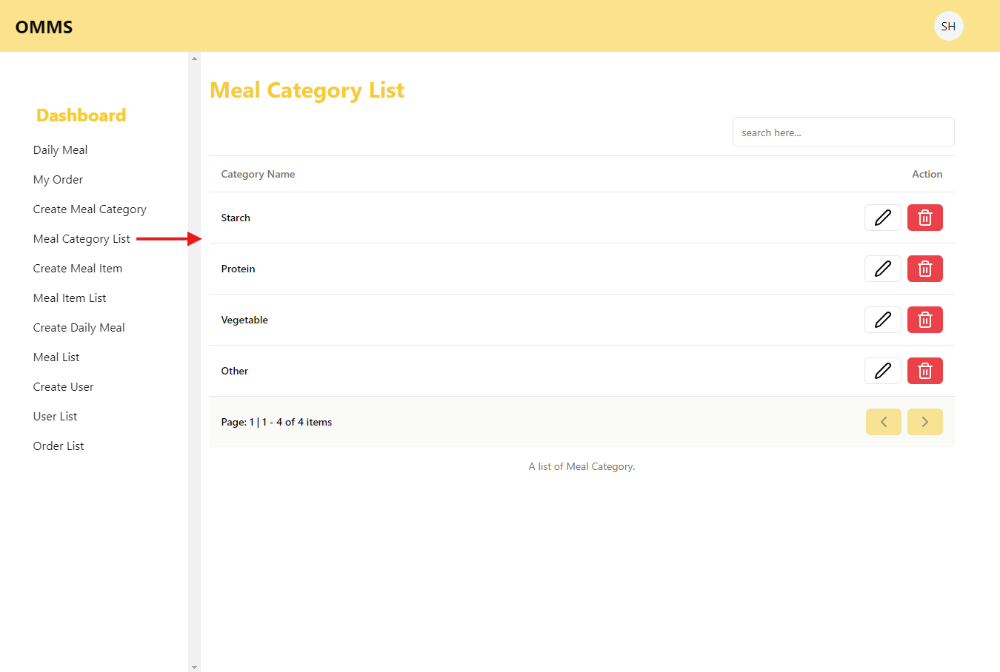

# OMMS (Office Meal Management System)
This project is a take home assignment provided by Manush Tech. As per the requirements this project is created using React, NodeJS, ExpressJS, PostgreSQL(Or any other relational DB), Redux, Tanstack Query etc.

## Key Features:
### Authentication:
      - Sign-In Page (users will use email and password as credentials)
      - JWT-based Authentication
      - Banned Users cannot log in and will see a prompt indicating they are banned.

### **User Management Page (Admins Only):**
      - Add Users
      - Data Table with Filters (Search, Pagination)
      - Roles: Admin and General Users
      - Admins can update and ban users.
      - Banned users cannot log in to the system.

### - **Item Management Page (Admins Only):**
    - Add and Delete Items
    - Items include food categories like:
        - Chicken Curry (Protein)
        - Rice (Starch)
        - Fish Curry (Protein)
        - Egg Curry (Protein)
        - Egg Bhorta
        - Potato Bhorta (Veg)
        - Daal
        - Begun Bhaji (Veg)
### - **Meal Management Page (Admins Only):**
    - Set Meals for 5 days a week.
    - Each Meal will have a set number of items.
    - Meal Constraints:
        1. A meal must have a rice item to be complete.
        2. A meal must have at least 3 items to be complete.
        3. A meal cannot have two protein sources at a time.
    - Schedule meals for specific days (e.g., a meal with rice, chicken curry, and daal available only on Sundays).
    - The same meal can only be repeated a maximum of two days in a week.

### - **Meal Order Page (General Users):**
    - View weekly meal schedules.
    - Select and update meal choices for each day.
    - Cannot modify meals for previous days (e.g., on Tuesday, cannot change meals for Sunday and Monday).
    - Schedule meals for an entire month.
    - Option to select "No Meal" for any day.

### - **Meal Schedule Page (Admins Only):**
    - View meal choices for every user.
    - General users cannot access this page.

## Installation and setup - Frontend
How to install-

```npm
npm install
```

or,

```npm
yarn
```

setup .env file-

```env
VITE_APP_BASE_URL=http://localhost:5000/api
```

run project-

```npm
npm run dev
```
or,

```yarn
yarn dev
```

## Frontend View
### Banner


### A Simple Login Page


### Ban User Alert Above of the Login Button


### After Login User(Admin) Will See the Dashboard


### Daily Meal Displayed based on Day


### Display Meal Category in the data table


### Create a Meal Item based on Meal Category


### Meal Item List & Pagination is properly visible here with active next button


### Create complete meal based on day


### Complete meal list displayed in the table


### Create user form


### Some users displayed in the data table


### Order List


### A Modal will be open before delete something.


### Logout Button

